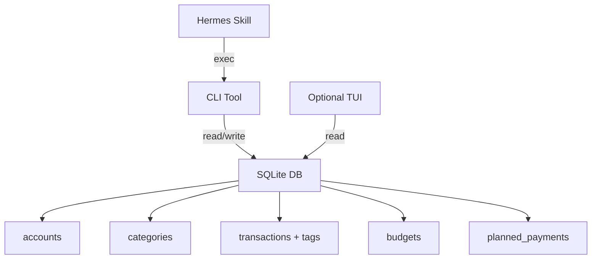

# Wallet App — Brainstorming

> Branch: `brainstorming` | Date: 2026-07-02
> Scope: Personal single-user finance tracker, SQLite-backed, AI-native, open source

---

## 🎯 Refined Scope

### ✅ IN (MVP+)
- **Expense & Income** — two transaction types, manual entry (no bank sync)
- **Categories** — hierarchical? flat? user-defined with defaults
- **Tags/Labels** — freeform tags on transactions
- **Budgeting** — monthly/periodic budget per category
- **Forecasting** — projected cash flow based on planned payments + historical trends
- **Planned Payments** — recurring (monthly subscriptions, bills) + one-time (future purchases)
- **Multi-currency** — accounts & transactions in different currencies
- **AI-native** — designed for Hermes to interact via skill (CLI or API)
- **SQLite** — single file database, local-first, no server needed

### ❌ OUT
- Multi-user / auth system
- Bank integration / Plaid / Salt Edge
- SaaS / cloud sync
- Mobile app (maybe later, not MVP)
- Investment tracking (maybe later)

---

## 🏗️ Architecture Decisions (to decide)

### 1. Interaction Model

| Option | Pros | Cons |
|--------|------|------|
| **CLI-only** | Dead simple, Hermes-native, no UI to build | No visual reports, harder to browse history |
| **REST API + CLI wrapper** | Hermes hits API, optional Web UI later | More overhead, needs server process |
| **SQLite + Hermes skill directly** | Hermes queries DB directly, ultra-simple | Hermes needs SQL knowledge, no data validation layer |
| **CLI + TUI (Textual/Bubbletea)** | Rich terminal UI, visual charts in terminal | More development effort |

### 2. Tech Stack Options

| Language | Pros | Cons |
|----------|------|------|
| **Go** | Single binary, fast, your core lang, great CLI libs (cobra, bubbletea) | Less data-science-y for forecasting |
| **Python** | Best for forecasting/ML, SQLite built-in, rich CLI (typer, textual) | Distribution (need Python runtime) |
| **Java** | Your primary lang | Heavy for a CLI, overkill for SQLite |

### 3. Data Model (Draft)

```
accounts
  id, name, currency, type (checking/savings/cash/credit), balance, created_at

categories
  id, name, parent_id, type (expense/income/both), icon, color

transactions
  id, account_id, category_id, type (expense/income/transfer),
  amount, currency, original_amount, original_currency,
  description, notes, date, created_at

tags
  id, name

transaction_tags
  transaction_id, tag_id

budgets
  id, category_id, amount, period (monthly/weekly/yearly),
  start_date, end_date, rollover (bool)

planned_payments
  id, type (recurring/one_time), account_id, category_id,
  amount, currency, description,
  recurrence_rule (cron-like or RRULE),
  start_date, end_date, next_due_date, is_active

forecasts (computed, maybe not stored?)
  - projected balance timeline
  - category spending projections
  - bill calendar
```

### 4. AI-Native Design

How Hermes interacts:
- **CLI interface**: `wallet add "Lunch at Warung" 35000 --category food --tags lunch`
- **Query interface**: `wallet report --month july --category food`
- **Skill**: Hermes skill wraps CLI, knows the schema, handles natural language → CLI
- **JSON output mode**: `wallet report --json` for machine parsing
- **DB path**: configurable via env or `~/.wallet/wallet.db`

Example Hermes interactions:
```
"Catat pengeluaran makan siang 35rb tadi"     → wallet add ...
"Berapa sisa budget food bulan ini?"          → wallet budget food
"Prediksi cash flow minggu depan"             → wallet forecast --next-week
"Tagihanku apa aja yang jatuh tempo minggu ini?" → wallet bills --this-week
```

---

## 🤔 Open Questions

1. **Web UI or not?** CLI + TUI cukup? Atau butuh simple web dashboard?
2. **Forecasting approach:** Simple heuristic (average N months) atau ML-based (prophet/arima)?
3. **Category hierarchy:** Flat tags atau nested categories (Food > Restaurant > Fast Food)?
4. **Multi-currency:** Store everything in one base currency with conversion, atau keep original amounts?
5. **Receipt/attachment:** Perlu attach foto struk ke transaksi?
6. **Import/Export:** CSV import? Export format apa?
7. **Go vs Python?** Lu prefer Go kan? Tapi forecasting lebih natural di Python.

---

## 🚀 Suggested MVP



**MVP features (order):**
1. `wallet init` — create DB
2. `wallet add expense/income` — manual entry
3. `wallet list` — view transactions with filters
4. `wallet category` — manage categories
5. `wallet budget` — set & check budgets
6. `wallet bill` — planned payments
7. `wallet forecast` — cash flow projection
8. `wallet report` — monthly summary

---

## 📊 Competitor Reference (simplified scope peers)

| Tool | Approach | Notes |
|------|----------|-------|
| **ledger/hledger** | Plain-text accounting, CLI | Double-entry, powerful but steep learning |
| **beancount** | Python, plain-text | Like ledger but Python, good for devs |
| **Firefly III** | Web, self-hosted, PHP | Full-featured but heavy |
| **Actual Budget** | Local-first, Node.js | Envelope budgeting, good UX |
| **Expense.fyi** | Self-hosted, simple | Minimalist, close to our scope |

**Our niche:** CLI-first, AI-native, Go, SQLite — none of the above are CLI-first + AI-native + Go. Most are either heavy web apps or plain-text accounting that requires learning a DSL.

---

## Next Steps

- [ ] Decide interaction model (CLI vs TUI vs API)
- [ ] Decide language (Go vs Python vs hybrid)
- [ ] Finalize data model
- [ ] Define MVP v0.1 feature list
- [ ] Start building
