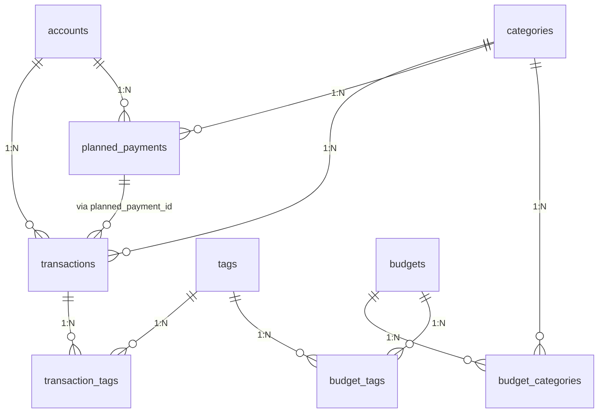

# 01 — Data Model

> Depends on: none
> Status: ✅ design approved | Unblocks: 02-project-skeleton
> Decisions: Language=Go, Transfer=single-row, Budget=snapshot, Categories=2-level, Tags=both+categories

---

## Objective

Define the SQLite schema that serves as the single source of truth. Every future phase (CLI, transactions, budgeting, forecasting, AI integration) reads from and writes to these tables.

---

## Design Decisions (Approved)

| # | Decision | Choice | Rationale |
|---|----------|--------|-----------|
| D1 | Transfer representation | Single row with `transfer_to_id` | Transfers aren't income/expense; cleaner reporting |
| D2 | Budget period model | Snapshot per period (clone) | History preserved; limit changes don't corrupt past periods |
| D4 | Category hierarchy | 2-level (parent→child) | Grouped reporting without recursive CTE complexity |
| D5 | Tags + Categories | Both — budget by category OR tag | Categories=structure, Tags=cross-cutting + alternative budget target |
| D6 | Budget target | Multiple categories OR multiple tags | M2M junctions — budget "Food+Transport" or "#vacation+#family" |
| D7 | Budget type | Recurring + one-time | Recurring auto-clones per period; one-time is single horizon |
| D8 | Multi-currency tx | Store original + converted amount | Track both; converted amount in account currency for balance |
| D9 | next_due_date | Pre-calculated, updated on fulfillment | No runtime computation needed |

---

## Schema

### `accounts`

Money storage entities: bank account, cash, e-wallet, credit card.

```sql
CREATE TABLE accounts (
    id            INTEGER PRIMARY KEY AUTOINCREMENT,
    name          TEXT NOT NULL,                    -- "BCA Checking", "GoPay", "Cash"
    type          TEXT NOT NULL DEFAULT 'checking', -- checking | savings | cash | credit_card | ewallet
    currency      TEXT NOT NULL DEFAULT 'IDR',      -- ISO 4217
    balance       INTEGER NOT NULL DEFAULT 0,       -- denormalized, minor units, updated on every write
    is_archived   INTEGER NOT NULL DEFAULT 0,
    sort_order    INTEGER NOT NULL DEFAULT 0,
    created_at    TEXT NOT NULL DEFAULT (datetime('now')),
    updated_at    TEXT NOT NULL DEFAULT (datetime('now'))
);
```

### `categories`

2-level hierarchical classification. Flat list with optional parent.

```sql
CREATE TABLE categories (
    id            INTEGER PRIMARY KEY AUTOINCREMENT,
    name          TEXT NOT NULL,                    -- "Restaurant", "Groceries"
    parent_id     INTEGER REFERENCES categories(id),-- NULL = top-level category
    type          TEXT NOT NULL DEFAULT 'expense',  -- expense | income | both
    icon          TEXT,                             -- "🍔"
    color         TEXT,                             -- "#FF5733"
    is_system     INTEGER NOT NULL DEFAULT 0,       -- built-in, non-deletable
    sort_order    INTEGER NOT NULL DEFAULT 0,
    created_at    TEXT NOT NULL DEFAULT (datetime('now'))
);
```

**Seed data (default categories):**

| Parent | Child | Type | Icon |
|--------|-------|------|------|
| Food & Dining | Restaurant | expense | 🍽️ |
| Food & Dining | Groceries | expense | 🛒 |
| Food & Dining | Coffee & Snacks | expense | ☕ |
| Transportation | Fuel | expense | ⛽ |
| Transportation | Public Transit | expense | 🚌 |
| Transportation | Ride-hailing | expense | 🚕 |
| Shopping | Clothing | expense | 👕 |
| Shopping | Electronics | expense | 📱 |
| Shopping | Household | expense | 🏠 |
| Bills & Utilities | Electricity | expense | ⚡ |
| Bills & Utilities | Internet | expense | 🌐 |
| Bills & Utilities | Phone | expense | 📞 |
| Bills & Utilities | Subscriptions | expense | 🔁 |
| Entertainment | Movies & Shows | expense | 🎬 |
| Entertainment | Gaming | expense | 🎮 |
| Entertainment | Travel | expense | ✈️ |
| Health | Medical | expense | 💊 |
| Health | Fitness | expense | 🏋️ |
| Education | Courses | expense | 📚 |
| Education | Books | expense | 📖 |
| Income | Salary | income | 💰 |
| Income | Freelance | income | 💻 |
| Income | Investment | income | 📈 |
| Income | Other | income | 💵 |

### `tags`

Freeform cross-cutting labels.

```sql
CREATE TABLE tags (
    id            INTEGER PRIMARY KEY AUTOINCREMENT,
    name          TEXT NOT NULL UNIQUE,             -- "vacation", "reimbursable", "2026-japan"
    color         TEXT,
    created_at    TEXT NOT NULL DEFAULT (datetime('now'))
);
```

### `transactions`

Core entity — every money movement.

```sql
CREATE TABLE transactions (
    id              INTEGER PRIMARY KEY AUTOINCREMENT,
    account_id      INTEGER NOT NULL REFERENCES accounts(id),
    category_id     INTEGER REFERENCES categories(id),
    type            TEXT NOT NULL,                   -- expense | income | transfer
    amount          INTEGER NOT NULL,                -- D8: original amount, minor units
    currency        TEXT NOT NULL DEFAULT 'IDR',     -- D8: original currency, ISO 4217
    base_amount     INTEGER,                         -- D8: converted to account currency (NULL if same as currency)
    base_currency   TEXT,                            -- D8: account currency after conversion
    description     TEXT,                            -- "Lunch at Warung Sederhana"
    notes           TEXT,
    transfer_to_id  INTEGER REFERENCES accounts(id), -- D1: for transfers only
    date            TEXT NOT NULL,                   -- YYYY-MM-DD (business date)
    is_planned      INTEGER NOT NULL DEFAULT 0,       -- 1 = auto-generated from planned payment
    planned_payment_id INTEGER REFERENCES planned_payments(id),
    created_at      TEXT NOT NULL DEFAULT (datetime('now')),
    updated_at      TEXT NOT NULL DEFAULT (datetime('now'))
);
```

### `transaction_tags`

M2M junction.

```sql
CREATE TABLE transaction_tags (
    transaction_id  INTEGER NOT NULL REFERENCES transactions(id) ON DELETE CASCADE,
    tag_id          INTEGER NOT NULL REFERENCES tags(id) ON DELETE CASCADE,
    PRIMARY KEY (transaction_id, tag_id)
);
```

### `budgets`

Per-period spending limit. D2: snapshot per period. D6: target is multiple categories OR multiple tags (via M2M). D7: recurring auto-clones; one-time is single horizon.

```sql
CREATE TABLE budgets (
    id              INTEGER PRIMARY KEY AUTOINCREMENT,
    name            TEXT,                                -- "Monthly Essentials", "Japan Trip 2026"
    amount          INTEGER NOT NULL,                    -- limit, minor units
    currency        TEXT NOT NULL DEFAULT 'IDR',
    type            TEXT NOT NULL DEFAULT 'recurring',   -- D7: recurring | one_time
    period_start    TEXT NOT NULL,                       -- YYYY-MM-DD
    period_end      TEXT NOT NULL,                       -- YYYY-MM-DD
    notify_at_pct   INTEGER DEFAULT 80,                  -- alert at X%
    is_active       INTEGER NOT NULL DEFAULT 1,
    created_at      TEXT NOT NULL DEFAULT (datetime('now'))
);
```

### `budget_categories`

M2M: budgets ↔ categories (D6).

```sql
CREATE TABLE budget_categories (
    budget_id    INTEGER NOT NULL REFERENCES budgets(id) ON DELETE CASCADE,
    category_id  INTEGER NOT NULL REFERENCES categories(id) ON DELETE CASCADE,
    PRIMARY KEY (budget_id, category_id)
);
```

### `budget_tags`

M2M: budgets ↔ tags (D6).

```sql
CREATE TABLE budget_tags (
    budget_id  INTEGER NOT NULL REFERENCES budgets(id) ON DELETE CASCADE,
    tag_id     INTEGER NOT NULL REFERENCES tags(id) ON DELETE CASCADE,
    PRIMARY KEY (budget_id, tag_id)
);
```

**Examples:**

| Budget | Type | Targets | Period |
|--------|------|---------|--------|
| "Monthly Essentials" | recurring | Food & Dining + Transportation + Bills | Jul 1–31, auto-clone to Aug |
| "Japan Trip 2026" | one_time | #japan-2026 tag | Jan 1 – Dec 31 |
| "Dining & Entertainment" | recurring | Restaurant + Coffee + Entertainment | Jul 1–31 |

**Constraint:** A budget must have at least one target (category or tag). Enforced at application layer.

### `planned_payments`

Recurring bills, subscriptions, and one-time future transactions.

```sql
CREATE TABLE planned_payments (
    id              INTEGER PRIMARY KEY AUTOINCREMENT,
    account_id      INTEGER NOT NULL REFERENCES accounts(id),
    category_id     INTEGER REFERENCES categories(id),
    type            TEXT NOT NULL DEFAULT 'expense',     -- expense | income
    amount          INTEGER NOT NULL,
    currency        TEXT NOT NULL DEFAULT 'IDR',
    name            TEXT NOT NULL,                       -- "Netflix", "Monthly Rent"
    recurrence      TEXT NOT NULL DEFAULT 'none',        -- none | daily | weekly | monthly | yearly | custom
    recurrence_rule TEXT,                                -- RRULE (RFC 5545) for custom patterns
    start_date      TEXT NOT NULL,
    next_due_date   TEXT,                                -- D9: pre-calculated, updated on fulfillment
    is_paused       INTEGER NOT NULL DEFAULT 0,
    created_at      TEXT NOT NULL DEFAULT (datetime('now')),
    updated_at      TEXT NOT NULL DEFAULT (datetime('now'))
);
```

### `exchange_rates`

Cached rates for multi-currency support.

```sql
CREATE TABLE exchange_rates (
    id              INTEGER PRIMARY KEY AUTOINCREMENT,
    from_currency   TEXT NOT NULL,
    to_currency     TEXT NOT NULL,
    rate            REAL NOT NULL,
    source          TEXT DEFAULT 'manual',
    fetched_at      TEXT NOT NULL DEFAULT (datetime('now'))
);
CREATE UNIQUE INDEX idx_exchange_rates_unique
    ON exchange_rates(from_currency, to_currency, fetched_at);
```

---

## Entity Relationships



---

## Resolved Questions

| # | Question | Resolution |
|---|----------|------------|
| OQ1 | Exchange rates in MVP? | ✅ Yes — keep `exchange_rates` table |
| OQ2 | Store original or convert? | ✅ Both: `amount`+`currency` (original) + `base_amount`+`base_currency` (converted) |
| OQ3 | `next_due_date` computed or pre-calc? | ✅ Pre-calculated, updated on fulfillment |
